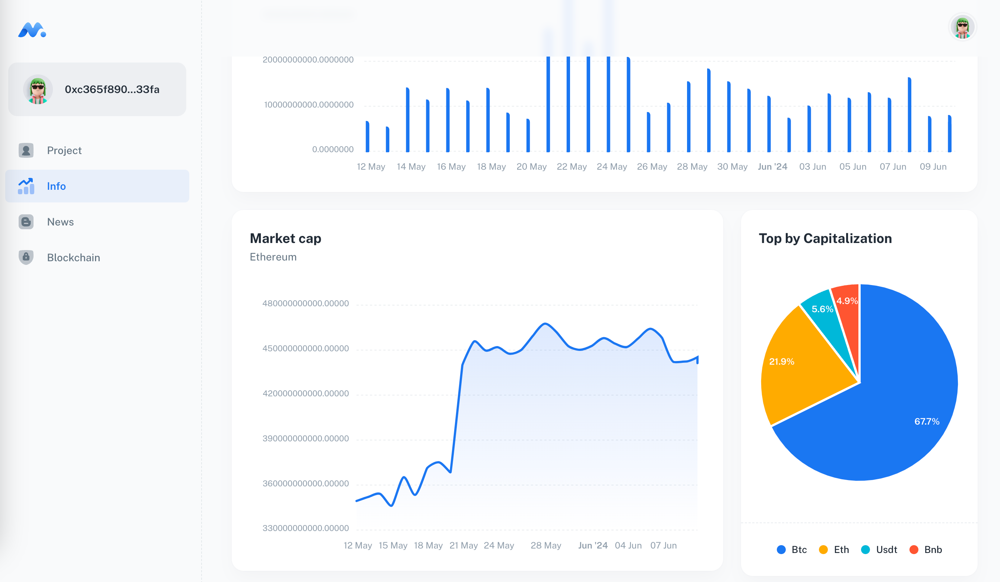

# DApp for Managing Employment Relationships

This project is a decentralized application (DApp) designed for creating and managing smart contracts that regulate employment relationships between employees and employers.

## Main Components

- **client**: The client-side application for interacting with the contract through a web browser.
- **api-microservice**: A microservice for parsing news and information about the Ethereum coin.
- **server**: A server for storing auxiliary information for the smart contract.
- **smart-contract**: The smart contract written in Solidity.

## Contents

1. [Client](./client/README.md)
2. [API Microservice](./api-microservice/README.md)
3. [Server](./server/README.md)
4. [Smart Contract](./smart-contract/README.md)

Each of these folders contains its own README file, which provides detailed functionality and usage instructions for the respective component.

## UI

#### Architecture

#### Login page

#### Project page

#### Info page

#### News page

#### Blockchain page

